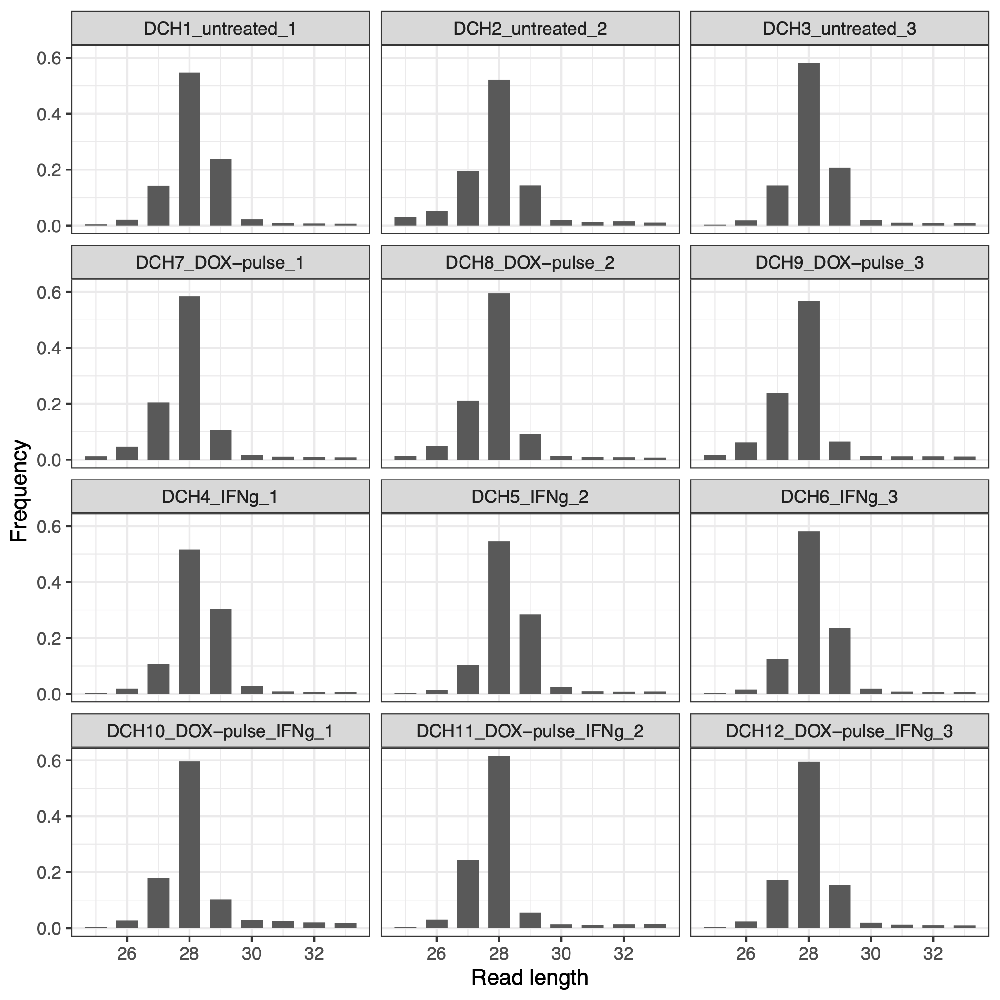
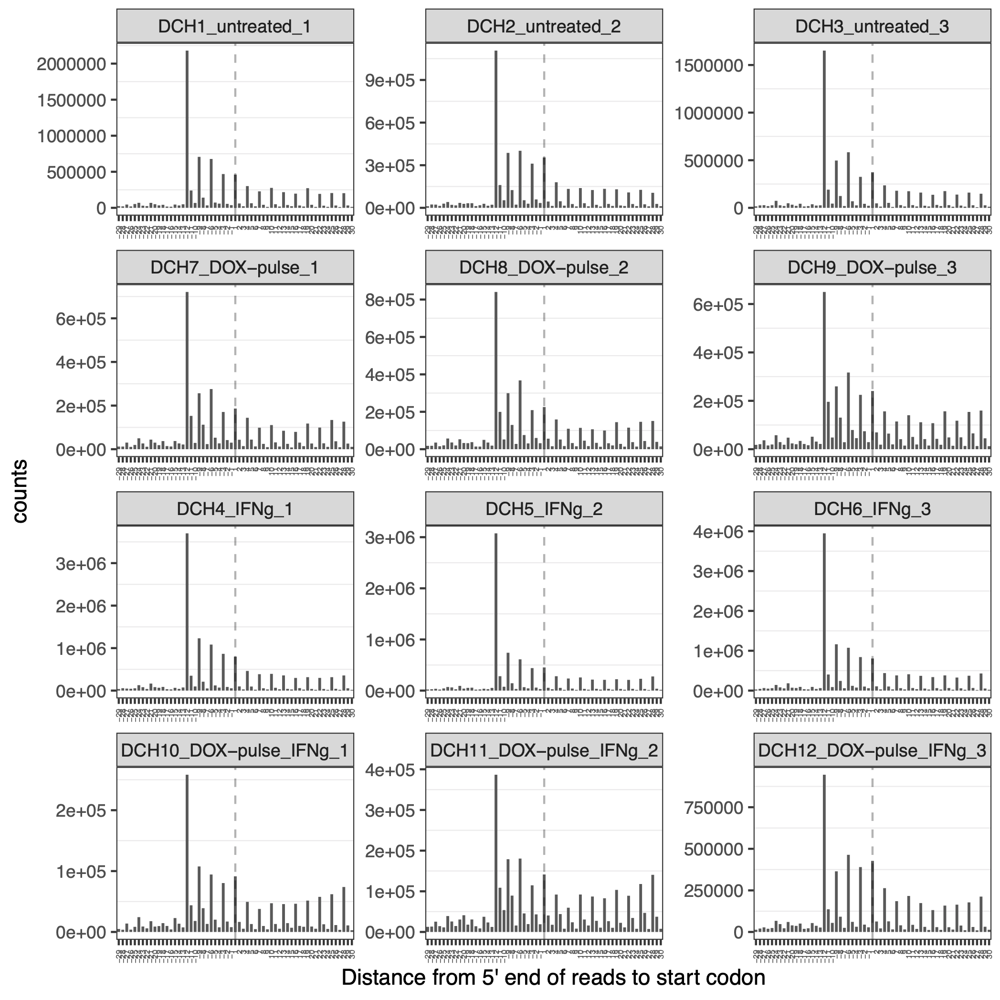
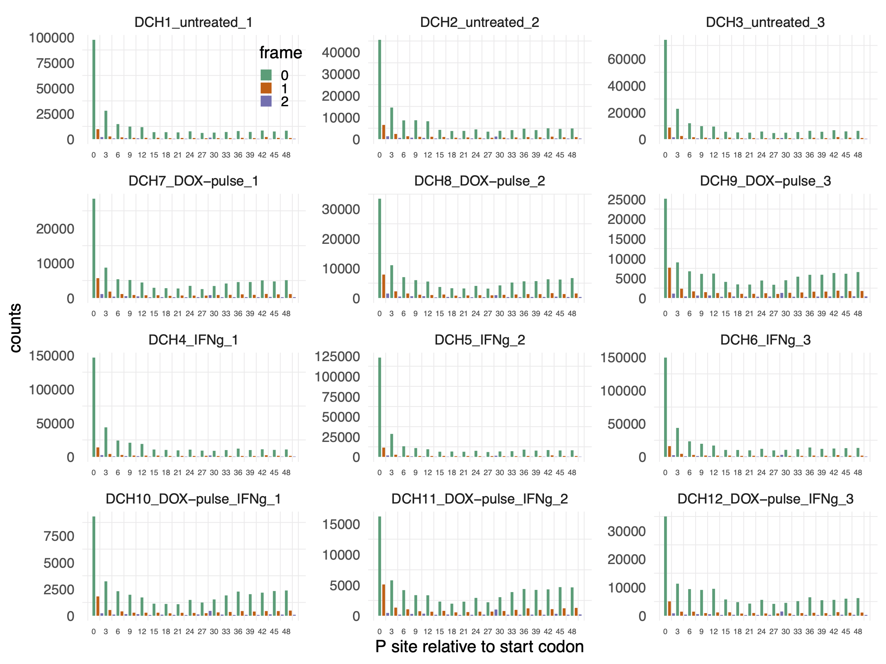
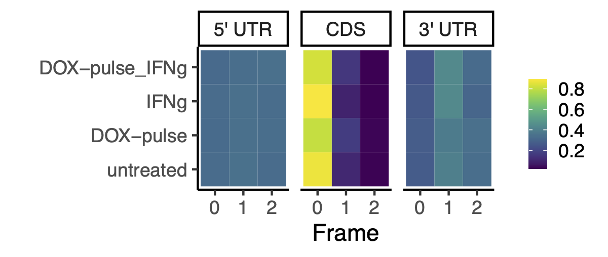
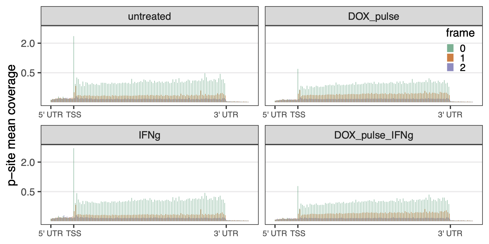

# Ribosome footprints quality control {#rpfs-qc}


In this chapter, we assessed the quality of the ribosome footprints (RPFs) in several aspects by using Bioconductor’s _ribosomeProfilingQC_ package and the in-hoouse ad-hoc functions. The aspects include:  

Our assessment included the following:

1. __RPF size__: We calculated the size distribution of the RPFs to ensure that most of them aligned with the expected size of ribosomes (26-29 nt).
2. __Translation start site offset enrichment__: We visualized the distance from the 5' end of reads to the start codon to determine the optimal offset for p-sites.
3. __P-sites and reading frames__: After determining the optimal offset, we estimated the p-sites coordinates of RPFs with the dominant length (26-29 nt) and verified that p-sites were in-frame around the start codon.
4. __Trinucleotide periodicity on transcripts__: We generated a meta-gene p-sites coverage plot colored by reading frames to illustrate the trinucleotide footprint periodicity from the 5' UTR, CDS, to the 3' UTR.

Following our evaluation of RPF and p-site quality, we profiled PRFs by counting p-sites on various genomic features (Chapter \@ref(profiling)). These features included the 5' UTR, 13 nt up/down-stream from the translation start sits, first coding exons, CDS, and the 3' UTR.

The primary [script](https://github.com/FredHutch/DUX4-IFNg-ribosome-footprints/scripts/020-use_riboProfilingQC.R) used for RPF QC can be found here. Please note that we have not included BAM files in our repository, and therefore the code chunks in this chapter that involve BAM files could not be evaluated. As a result, the figures in this section were pre-generated.

## Preparation
The code chunk below loads the libraries:
```{r loading-lib-dataset, eval=FALSE, message=FALSE}
library(ribosomeProfilingQC)
library(tidyverse)
library(DESeq2)
library(Rsamtools)
library(GenomicFeatures)
library(GenomicAlignments)
library(hg38.HomoSapiens.Gencode.v35)
txdb <- hg38.HomoSapiens.Gencode.v35
library(BSgenome.Hsapiens.UCSC.hg38)
genome <- BSgenome.Hsapiens.UCSC.hg38
library(BiocParallel)
bp_param=MulticoreParam(workers = 4L)
register(bp_param, default=TRUE)

pkg_dir <- "/fh/fast/tapscott_s/CompBio/Ribo-seq/hg38.DUX4.IFN.ribofootprint.2"
scratch_dir <- "/fh/scratch/delete90/tapscott_s/hg38.DUX4.IFN.ribofootprint.R1"
fig_dir <- file.path(pkg_dir, "figures", "QC")
source(file.path(pkg_dir, "scripts", "tools.R"))
source(file.path(pkg_dir, "scripts", "fork_readsEndPlot.R"))
```

Building sample information:
```{r sample-info, eval=FALSE}
bam_dir <- file.path(scratch_dir, "bam", "merged_bam_runs")
bam_files <- list.files(bam_dir, pattern=".bam$", full.names=TRUE)
sample_info <- data.frame(
  bam_files = bam_files <- list.files(bam_dir, pattern=".bam$", full.names=TRUE)) %>%
    dplyr::mutate(sample_name = str_replace(basename(bam_files),
                                            ".bam", ""),
                  treatment = str_replace(str_sub(sample_name, start=1L, end=-3L), "[^_]+_", "")) %>%
    dplyr::mutate(treatment = factor(treatment, levels=c("untreated", "DOX-pulse", "IFNg", "DOX-pulse_IFNg")))
```


## Esitmate the optimal read lengths
The code chunk below utilizes the `ribosomePrfilingQC` package to obtain the length of the RPFs and determine the optimal read lengths. Figure \@ref(fig:include-size-length) illustrates that the majority of RPFs have a size range of 26-29 nt.


```{r optimal-read-lengths, eval=FALSE}
# (a) read length frequency
read_length_freq <- bplapply(sample_info$bam_files, function(x) {
  bam_file <- BamFile(x)
  p_site <- estimatePsite(bam_file, CDS, genome)
  pc <- getPsiteCoordinates(bam_file, bestpsite = p_site)
  read_length_freq <- summaryReadsLength(pc, widthRange = c(25:39), plot=FALSE)
})
names(read_length_freq) <- sample_info$sample_name

# (b) tidy data
length_freq <- map_dfr(names(read_length_freq), function(x) {
  as.data.frame(read_length_freq[[x]]) %>%
    dplyr::rename(length="Var1") %>%
    add_column(sample_name=x) %>%
    dplyr::mutate(order = as.numeric(length)) %>%
    dplyr::mutate(length = as.numeric(as.character(length)))
}) %>%
  left_join(dplyr::select(sample_info, sample_name, treatment),
            by="sample_name") %>%
  dplyr::arrange(treatment) %>%
  dplyr::mutate(sample_name = factor(sample_name, levels=unique(sample_name)))

# (c) plot
ggplot(length_freq, aes(x=length, y=Freq)) +
  geom_bar(stat="identity", width=0.7) +
  theme_bw() +
  facet_wrap( ~ sample_name, nrow=4) +
  labs(x="Read length", y="Frequency")
ggsave(file.path(fig_dir, "freqment_size_frequency.pdf"))
```

```{r include-size-length, fig.align='center', fig.cap='Distribution of size of RPF segments', out.width='600px', fig.retina=1}

```


## Distance from 5' end of reads to the start codon

The distance between the 5' end of reads and the start codon of the CDS can be useful in determining the optimal position for p-sites. Figure \@ref(fig:distant-to-start-codon) illustrates that the 5' end of reads are enriched at 13 positions upstream from the start codon, indicating that the best p-sites are located at the 13th nucleotide of the RPF segment and that many ribosomes are docking at the translation start sites.

It should be noted that while the `ribosomeProfilingQC::readsEndPlot()` function is intended to generate such a plot, it has a flaw that fails to reverse the mapping for genes on the negative strand. To address this issue, I forked the function and corrected the mistake. (I will later fork the package and make it available on Github. In the meantime, I am using the `fork_readsEndPlot` function from [scripts/fork_readsEndPlot.R](https://github.com/FredHutch/DUX4-IFNg-ribosome-footprints/scripts/fork_readsEndPlot.R).

Through the rest of QC processes, we focus on the optimal read lengths of 26 to 29 nucleotides. The following code estimates the pileup of the 5' ends of reads 30 positions upstream and downstream from the start codon. This allows us to examine the distribution of ribosome footprints in the region surrounding the start codon, which can be used to determine the optimal offset for p-site from the start codon. 


```{r 5end-distance-to-start-codon, eval=FALSE}
read_length <- c(26:29) # optimal read lengths
# (a) distance to start codon [-29, 30]
start_codon_30 <- bplapply(sample_info$bam_files, function(x) {
  bam_file <- BamFile(x)
  fork_readsEndPlot(bam_file, CDS, toStartCodon=TRUE, readLen=read_length, window=c(-29, 30))
  #ribosomeProfilingQC::readsEndPlot(bam_file, CDS_pos, toStartCodon=TRUE, readLen=read_length,
  #             window= c(-29, 30))
})
names(start_codon_30) <- sample_info$sample_name

# (b) tidy data and hist (bar)
.tidy_dist_data <- function(dist_list) {
  dist <- map_dfr(names(dist_list), function(x) {
    as.data.frame(dist_list[[x]]) %>%
    dplyr::rename(counts = `dist_list[[x]]`) %>%
    tibble::rownames_to_column(var = "dist") %>%
    tibble::add_column(sample_name = x) %>%
    dplyr::mutate(dist = factor(dist, levels=dist)) 
  }) %>%
    dplyr::left_join(dplyr::select(sample_info, sample_name, treatment), by="sample_name") %>%
    dplyr::arrange(treatment) %>%
    dplyr::mutate(sample_name = factor(sample_name, levels=unique(sample_name)))
}

dist <- .tidy_dist_data(start_codon_30)
ggplot(dist, aes(x=dist, y=counts)) +
  geom_bar(stat="identity", width=0.7) +
  theme_bw() +
  labs(x="Distance from 5' end of reads to start codon", y="counts") +
  facet_wrap( ~ sample_name, nrow=4, scale="free") +
  geom_vline(xintercept = which(dist$dist == 1),
             linetype="dashed", alpha=0.3, show.legend=FALSE) +
  theme(axis.text.x=element_text(angle = 90, hjust = 1, vjust=0.5, size=4),
        panel.grid.major = element_blank(), #panel.grid.minor = element_blank(),
        panel.background = element_blank())
ggsave(file.path(fig_dir, "distance_from_5end_to_start_codon_30-fork-readsEndPlot.pdf"))#, width=8, height=6)
```

```{r distant-to-start-codon, fig.align='center', fig.cap='Distance from 5 prime end reads to start codon reveals the best position of p-site: 13 nucleotide shift', out.width='600px'}


```

## P-sites and reading frames 
To determine the p-site coordinates and assign reading frames within annotated CDS, we utilized the `ribosomeProfilingQC::getPsiteCoordinates()` and `ribosomeProfilingQC::assigneReadingFrame()` functions. We then visualized the resulting p-site positions around the translation start sites, color-coding them by reading frames. Figure \@ref(fig:reading-frame-tss) demonstrates that the p-sites were accurate and in-frame with the start codon.

```{r reading-frame-around-start-codon, eval=FALSE}
reading_frame <- bplapply(sample_info$bam_files, function(x) {
  bam_file <- BamFile(x)
  p_site <- estimatePsite(bam_file, CDS, genome) # 13
  pc <- getPsiteCoordinates(bam_file, bestpsite = p_site)
  pc_sub <- pc[pc$qwidth %in% read_length]
  pc_sub <- assignReadingFrame(pc_sub, CDS)
  distance <- plotDistance2Codon(pc_sub)
})

names(reading_frame) <- sample_info$sample_name

# tidy reading_frame tool
.tidy_reading_frame <- function(rf_list) {
  rf <- map_dfr(names(rf_list), function(x) {
    rf_list[[x]] %>% as.data.frame(stringsAsFactors=FALSE) %>%
      dplyr::rename(index="Var1", Frequency="Freq") %>%
      dplyr::mutate(index=as.numeric(index), Frequency=as.numeric(Frequency)) %>%
      dplyr::mutate(frame = as.factor(index %% 3)) %>%
      add_column(sample_name = x)
  })
}  

# ggplot
tidy_rf <- .tidy_reading_frame(reading_frame) %>%
  left_join(dplyr::select(sample_info, sample_name, treatment), by="sample_name") %>%
  dplyr::arrange(treatment) %>%
  dplyr::mutate(sample_name = factor(sample_name, levels=unique(sample_name)))

ggplot(tidy_rf, aes(x=index, y=Frequency, fill=frame)) +
    geom_bar(stat="identity", width=0.7) +
    theme_minimal() +
    facet_wrap( ~ sample_name, nrow=4, scale="free") +
    theme(legend.position=c(0.25, 0.93), legend.key.size = unit(0.3, 'cm'), 
          axis.text.x=element_text(size=5), panel.grid.major = element_blank()) +
    labs(x="P site relative to start codon", y="counts") +
    scale_x_continuous(breaks=seq(0, 50, 3)) +
    scale_fill_brewer(palette="Dark2")
ggsave(file.path(fig_dir, "reading_frame_psite_to_start_codon.pdf"), width=8, height=6)   
```
```{r reading-frame-tss, fig.align='center', fig.cap='Reading frames of p-sites on annotated CDS and around start codon', out.width='600px', fig.retina=1}

```

## Trinucleotide periodicity on transcripts

Here, we constructed a reading frame frequency plot and meta-gene plot of p-sites coverage, colored by reading frames, on annotated 5' UTR, CDS, and 3' UTR regions. Figure \@ref(fig:reading-frame-freq-transcripts) and Figure \@ref(fig:meta-gene-coverage) confirmed that (1) the enriched RPFs docked on the translation start sites, and (2) the trinucleotide footprint periodicity only occurred on the CDS.

Because the `ribosomeProfilingQC::assigneReadingFrame()` function only assigns reading frames for p-sites on the annotated CDS, I wrote [tools](https://https://github.com/FredHutch/DUX4-IFNg-ribosome-footprints/scripts/tools_assign_utr_frame.R) to assign reading frame to p-sites that are exclusively lay on the annotated UTR regions. Giving an overview of the trinucleotide periodicity on the whole transcripts, this [script](https://github.com/FredHutch/DUX4-IFNg-ribosome-footprints/scripts/10C-manuscript-figures-periodicity-reading-frames.R) constructed a meta-gene p-sites coverage in 5' UTR, CDS, and 3' UTR regions, as shown in Figure \@ref(fig:meta-gene-coverage).


```{r reading-frame-freq-transcripts, fig.align='center', fig.cap='Reading frame frequency on 5 prime UTR, CDS, and 3 prime UTR', out.width='450px'}

```
```{r meta-gene-coverage, fig.align='center', fig.cap='Meta-gene p-sites coverage', out.width='650px'}

```

